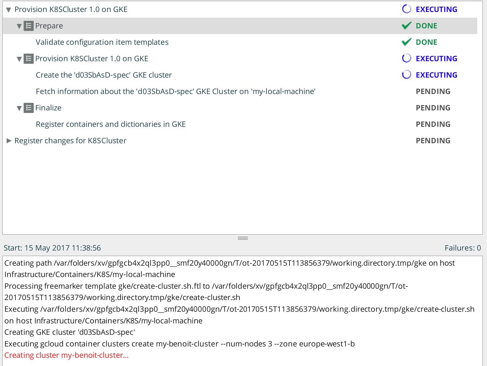
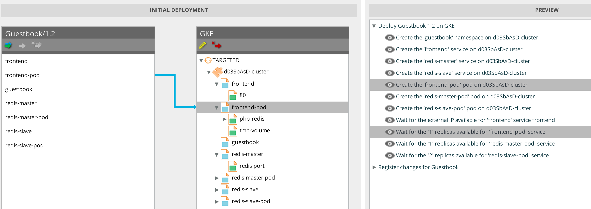

# xld-kubernetes-gke-plugin

# Overview #

This plugin is a XL Deploy plugin that adds capability for provisioning a new Google Container Engine (GKE) for Docker Containers and deploying containers on top of it.

# CI status #

[![Build Status][xld-kubernetes-gke-plugin-travis-image]][xld-kubernetes-gke-plugin-travis-url]

[xld-kubernetes-gke-plugin-travis-image]: https://travis-ci.org/xebialabs-community/xld-kubernetes-gke-plugin.svg?branch=master
[xld-kubernetes-gke-plugin-travis-url]: https://travis-ci.org/xebialabs-community/xld-kubernetes-gke-plugin

# Installation #

Place the plugin XLDP file into your `SERVER_HOME/plugins` directory.

# Dependencies

* XL Deploy 6.0+
* XL Deploy Kubernetes plugin 6.2.+

# Provision a new GKE cluster

# Deploy GuestBook Application

